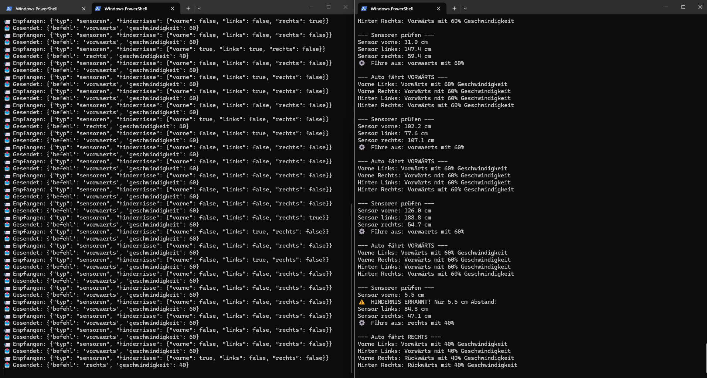

# 🚗 KI-gesteuertes RC-Auto

Autonomes Fahrzeug auf Basis eines Raspberry Pi mit KI-Objekterkennung, 
Sprachsteuerung via Claude API und automatischer Hindernissvermeidung.

## Hardware

- Raspberry Pi 5 (8GB)
- Raspberry Pi Camera Module 3
- Ultraschallsensoren HC-SR04 (vorne, links, rechts)
- L298N Motortreiber
- 4WD Robot Car Chassis Kit
- 18650 LiPo-Akku (7.4V)

## Software / KI-Komponenten

- YOLOv8 - Objekterkennung in Echtzeit
- OpenCV - Spurverfolgung
- Claude API - Sprachsteuerung
- pyttsx3 - Sprachausgabe

## Projektstruktur

- `motor/` - Motorsteuerung (4WD)
- `sensoren/` - Ultraschallsensoren
- `ki/` - Autonomes Fahren
- `sprachsteuerung/` - Claude API Integration
- `docs/` - Dokumentation

## Architektur

```
[Raspberry Pi 4]          [PC / Server]
- Motorsteuerung    <-->  - YOLOv8 Objekterkennung
- Ultraschallsensor       - Claude API Sprachsteuerung
- Kamera Stream           - Entscheidungslogik
- GPIO Steuerung          - Web Interface
        |                        |
        └────── WLAN ────────────┘
```

## Installation

```bash
git clone git@github.com:donat-julian/ki-auto.git
cd ki-auto
pip install -r requirements.txt
```

## Starten

```bash
python main.py
```

## Funktionen

- 🤖 Autonomes Fahren mit Hinderniserkennung
- 🎤 Sprachsteuerung via Claude API
- 📷 Objekterkennung mit YOLOv8 (in Entwicklung)
- 🕹️ Manuelle Steuerung (WASD)

## Web Interface

Das Auto wird über den Handy-Browser gesteuert - keine App nötig!

- 📱 Aufruf: `http://ki-auto.local:5000`
- 📷 Live-Kamera Stream
- 🕹️ Manuelle Steuerung (Pfeiltasten)
- 🎤 Sprachsteuerung via Claude API
- 🤖 KI-Antworten in Echtzeit

## Geplant

- YOLOv8 Objekterkennung integrieren
- Echtzeit-Kamera Stream
- Web-Interface für Fernsteuerung
- Raspberry Pi GPIO Integration

## Screenshots

### Server-Client Kommunikation


### Web Interface
